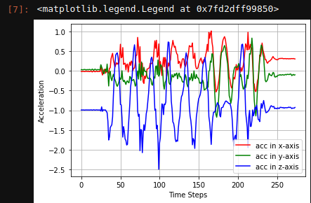

# MMR Data Pipeline
This 'pipeline' streams data and commits it an azure SQL database

## Installation
To install required packages, run the following command after creating a virtual env.
- in unix
```python
pip3 install -r requirements.txt
```
- in windows
```python
pip install -r requirements.txt
```

Before continuing, you need to have the PASSWORD and UID of the database.

Run the following in a terminal

```
$ export PASSWORD=verystrongpass
$ export USERID=awesomeuser
```

## Usage
Turn on bluetooth and you are good to go.

Run the following and choose an option for an exercise
```
python main.py
```
```
Connected
Services disconvered
Characteristics discovered
Descriptors found

Choose a number for an exercise below
1. Jumping Jacks
2. Squats
3. Jogs
4. Body Stretch(Arms)

2  <-- This is my choise

```

Then the output will be something like this
```
Logging data for squats
Finished!
Committing squats data to database...
Finished!

```

## Some challenges you might face
After running the program you might get something like this
```
error 1600154639.663913: Error on line: 296 (src/blestatemachine.cc): Operation now in progress
*** buffer overflow detected ***: terminated
Aborted (core dumped)

```
I'm not sure what the problem is, but if you run it one more time, boom. fixed :)

## Querying data
To query data you can create a notebook or just run along with a script

### import required packages

```python
import numpy as np
import matplotlib as mpl
import matplotlib.pyplot as plt

from model import BodyAccX, BodyAccY, BodyAccZ
from utils import Session
```
### Query first row of data
```python
s = Session()

x = s.query(BodyAccX).first().row_data
y = s.query(BodyAccY).first().row_data
z = s.query(BodyAccZ).first().row_data
```
### Prepare data
```python
def prep_data(x, y, z):
    x_list = x.split(', ')
    y_list = y.split(', ')
    z_list = z.split(', ')

    for i in range(len(x_list)):
        x_list[i] = float(x_list[i])
        y_list[i] = float(y_list[i])
        z_list[i] = float(z_list[i])

    new_x = np.array(x_list)
    new_y = np.array(y_list)
    new_z = np.array(z_list)
    
    return new_x, new_y, new_z

newx, newy, newz = prep_data(x, y, z)
```

### Visualize the data
```python
%matplotlib inline

fig = plt.figure()
ax = plt.axes()
ax.plot(newx, 'r', label='acc in x-axis')
ax.plot(newy, 'g', label='acc in y-axis')
ax.plot(newz, 'b', label='acc in z-axis')
ax.grid(True, which='both')
ax.set_ylabel('Acceleration')
ax.set_xlabel('Time Steps')
ax.legend()
```
